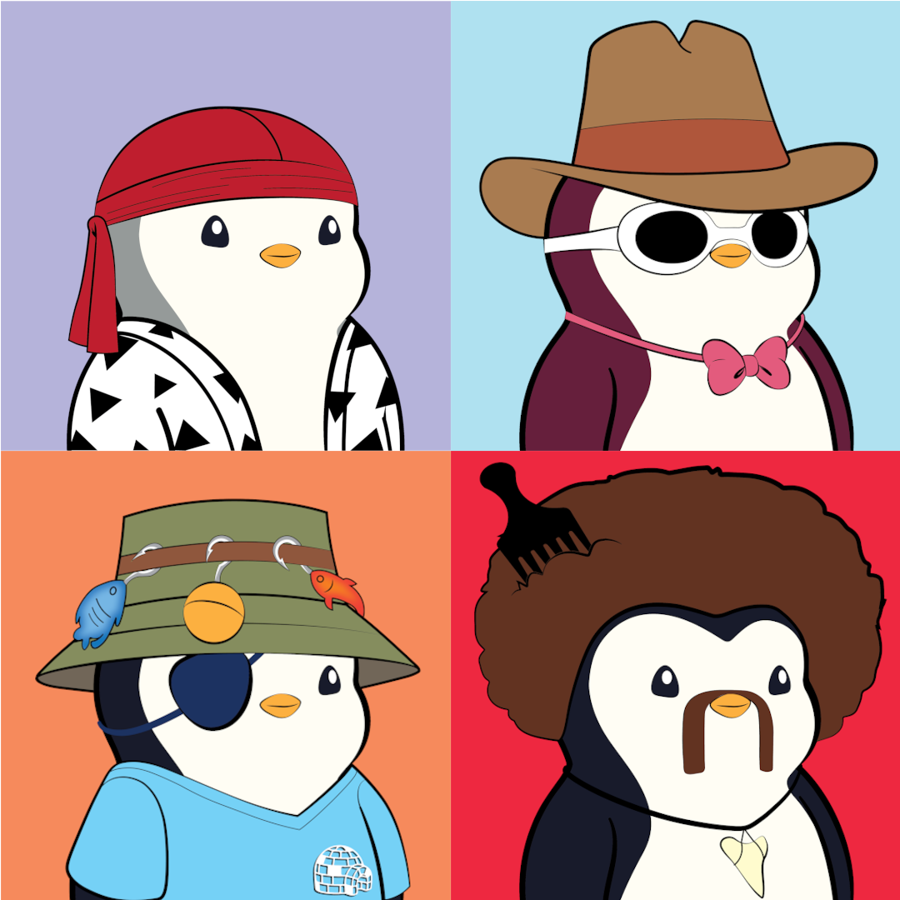

# t13 - Penguinz

<figure>
  
  <figcaption align="center">Team Penguinz</figcaption>
</figure>

## Member Information

| Last Name   | First Name  |    eName    |   GitHub     |      CSU Email           |
| ----------- | ----------- | ----------- | ------------ | ------------------------ | 
|   Hantke    |  Andy       | ahantke     | ahantke1     | ahantke@colostate.edu    |
|   Raissi    |  Amir       | amirr23     | amir-raissi  | amirr23@colostate.edu    |
|   Price     |  William    | bilprice    | bilprice     | bilprice@colostate.edu   |
|   Newby     |  Richard    | rjnewby     | richardnewby | rjnewby@colostate.edu    |
|   Barton    |  Tyler      | tmanb       | tmanbarton   | tmanb@rams.colostate.edu |

## Team Preferences

### Communcation
The best way to reach a team member is through either Slack or Discord. Teams, texting, and emailing work for some group members but not all, so be sure to check with that individual before texting/emailing them. The best times to reach team members are standard working hours 8am-6pm. Afterwards, some group members may still respond but sendees should not expect after hours responses in a timely matter.

### Organization
The team will have recurring standups on Tuesdays at 12:20pm, Tyler will be the SCRUM master. These will be through MS Teams. For members who have emergencies or are unable to make the meetings someone (the SCRUM master if they are present) will post a summary to slack. This will also help the team to recall previous meeting information. Outside of that, when needed additional standups can occur during the week via slack, as team members have conflicting schedules.

### Expectations
Each team member is responsible for completing the tasks assigned to them in Zenhub within the aggreed upon timeline. A new branch will be created when a feature or fix is implemented. The name of the branch will indicate the team member creating the branch and the issue being addressed. Before submitting pull requests team members will coordinate on Slack to determine another team member who will be responsible for reviewing and merging the pull request.

### Dealing with Adversity
As a team we are committed to communicating in a manner that is respectful at all times and addresses adversity in a way that does not include personal blame, judgement, or criticism. Overall, open communcation is needed in order for the team to preform its best. This may include having conversations with team members about their work and preformance. It is important to understand that team members should not take this feedback personally. If the circumstance presents itself where a team member feels personally attacked they should: bring it up with the group. If unable to resolve within the group: bring it up to Dave/TAs. In the situation where a deadlock occurs or if one team member disagrees with the rest, the team should work towards a comprimise with full consideration of both sides. After attempting first to compromise, the team will make a majority decision. 

### Accountability
In terms of accountability the team recognizes that this class requires a group effort and every member must contribute to the project. In order to keep group members accountable clear expectations are set during the sprint planning process. Each group member will know exactly what is expected from their contribution to the overall project. In addition to verbally communicating these expectations, the expectations are written down and posted in the Team Slack Channel. If a group member does not believe that they are able to meet these expectations they must communicate that with the rest of the team. The group will also maintain open and close communication with one another to make sure all is going to plan and no group member is struggling or encountering problems. If a team member fails to follow through with their commitment to the team, the team will discuss what led to this failure and decide how to proceed in the future.
