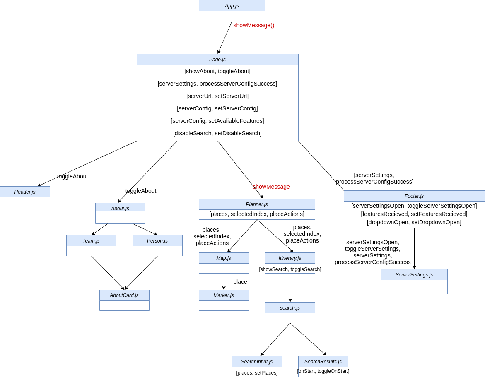
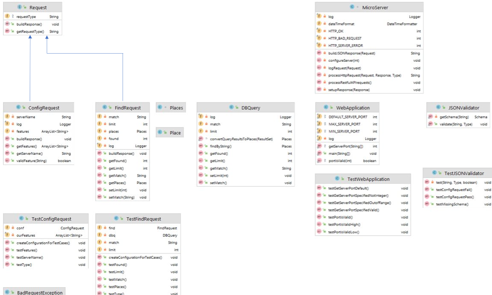
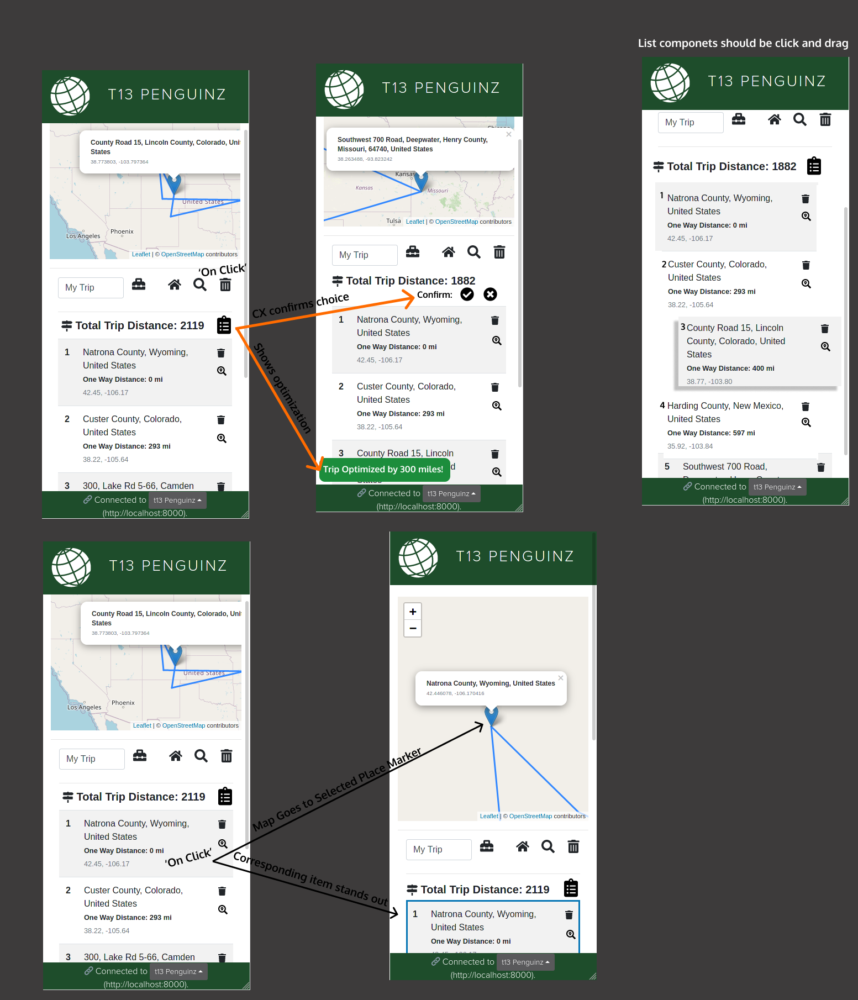
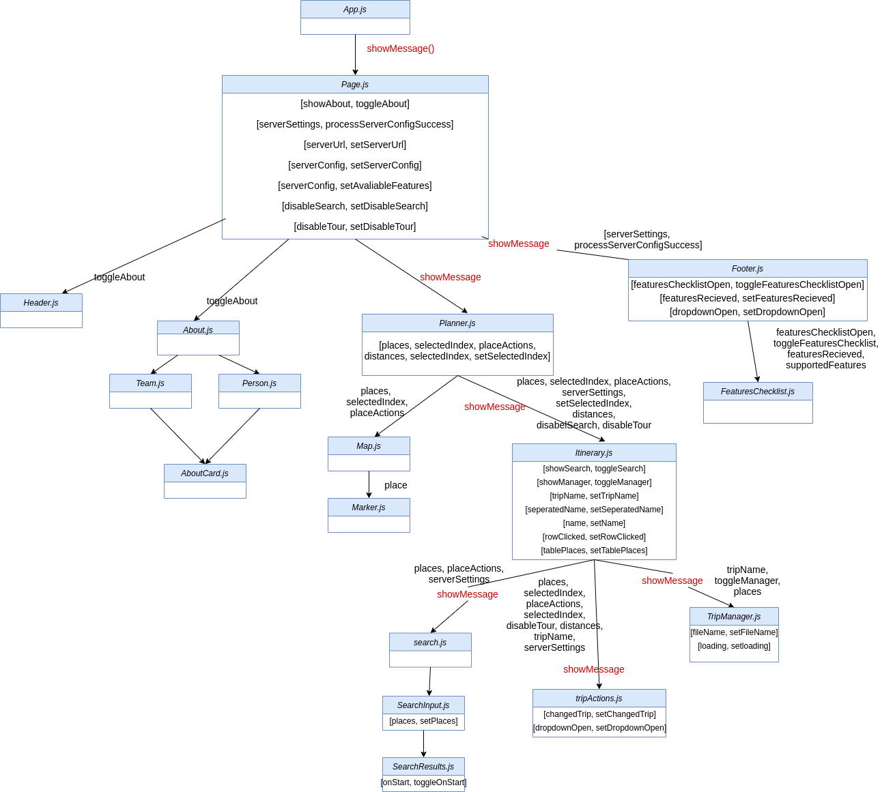

# Introduction

This document describes the architecture and design of a single page web application that interacts with microservices via RESTful APIs.
The key elements in this document include the architecture, user interface, client components, and server classes.

This is a living document that is updated as changes are made each sprint.
The initial document describes the Base code students are given as a starting point for the semester.
Students are expected to update this document as changes are made each sprint to reflect the evolution of their application and key decisions they make.
The Base section serves as an example.

# Base

The Base is a simple application to provide the architecture to the students at the beginning of the semester.
The JavaScript code will be useful examples for students to learn from and leverage in the code they write for sprint 1.
The progressive display of information using collapsible sections and popups will serve as examples of good user interface design.
The overall design is somewhat minimalist/simple for the intended mobile device audience.

### Architecture

The Base architecture is a JavaScript single page web application in an HTML5 browser that uses RESTful APIs to access Micro-services provided by a Java server running on Linux.
The client consists of a minimal index.html file that loads and executes the bundled JavaScript application.
The client and server files are bundled into a single JAR file for execution on the Linux server at a specified port.
The browser fetches the client files from the server on the specified port.

The browser loads the index.html file (by default) which in turn loads the bundled JavaScript single page application bundle.js.

- The single page application makes RESTful API requests to the server on the same port using JavaScript's asynchronous fetch.
- A protocol document describes the JSON format for the RESTful API requests and responses.
- JSON Schemas are used to verify requests on the server side and responses on the client side.
- On the client, ReactJS renders the application using ReactStrap, Leaflet, and application defined components.
- GSON is used on the server to convert JSON requests to Java objects and Java objects to JSON responses.
- The client (ulog) and server (SLF4J) logging mechanisms control debugging output during development and production - print statements and console logging should never be used.

The following architecture elements are not included in the Base system.
They will be added later in the semester.

- Client filesystem.
- Server SQL.
- Server concurrency.

### User Interface

The basic screen in black shows the view on a mobile device, with a header, footer, and trip.
The header contains an earth logo and the team name obtained from the server when the client was loaded.
The footer contains a connection icon along with the current server name and server URL the client is connected to.
The trip shows a map and the current list of destinations.

Rather than buttons or icons to signify actions, we are associating actions with elements that are already on the screen to reduce the clutter.
We are using both popups and collapsible sections in this design rather than choosing to use one exclusively.

- Collapsible/Hidden sections are used for the map and about sections since they have a significant amount of content and we don't need to see them at the same time.
- A popup is used for the URL change since we want to control the interaction until the operation is completed. It seemed more natural than another collapsible section.

#### Clicking on the team name in the header displays an empty about screen.

Clicking again restores the trip screen.
We will fill this in later.

#### Clicking on the map adds to the trip.

Whenever a user clicks on the map, the client should display a marker with latitude, longitude, and a description at that location.
The description is obtained from reverse geocoding.
The location information is also added to the trip list below the map.
We only maintain a single marker at this point displaying the most recently clicked location.

#### Clicking the hamburgers (&#8942;) displays a menu of options.

At the trip level you can add the home (CSU Oval) location or clear the list.
At the destination level you can remove that destination from the list.

#### Clicking on the URL in the footer should let me change the server.

Whenever a user clicks on the URL a popup should open showing the team name, the URL in an input text box, and a Cancel button.
When the user modifies the URL, the client will attempt to connect to the new server and update the configuration.
When the Test button is clicked, it will attempt to connect to the server.
If not successful, nothing changes and the user may continue to make URL changes or click the Cancel button to return to the original sever (it shouldn't change).
If successful, the new server name should appear and a Save button should replace the Test button.
When the user clicks the Save button, the server connection should change and the popup closes, revealing the new servername and URL in the footer.

### Component Hierarchy

The component hierarchy for the base application depicted below shows the top level App component with four children components.

- App renders the major components on the screen.
- Header renders an icon and a team name in the top banner.
- Footer renders the current server connection in the bottom footer.
- Atlas renders a map.
- About renders information about the team.

We do not show the many ReactStrap components in this hierarchy, even though they will appear when you are debugging on the client.

### Class Diagram

The class diagram for the base application depicted below shows the basic structure of the web server application.

The classes in blue represent the classes specific to this application.

- WebApplication processes command line parameters and creates MicroServer.
- MicroServer start a web server on the given port, configures the server for security, static files, and APIs for different types of requests, and processes the requests as they arrive.
- JSONValidator verifies a request is properly formatted before attempting to process it using JSON Schemas.
- ConfigRequest is a specific request that allows the server to respond with its configuration to allow interoperability between clients and servers.
- Request defines the basic components of all requests.
- BadReqeustException allows us to distinguish bad requests from other types of exceptions that may occur.

These test classes provide automated tests for unit testing.

- TestWebApplication
- TestConfigRequest
- TestJSONValidator

# Sprint 1

### User Interface

In this sprint, we will focus on team information.
There are two primary parts:

- browser tab, header, and footer.
- about page which includes team and member information,

Whenever a user clicks the team name in the header, a collapsible section should appear under the header with information about the team.
The collapsible map should disappear so only the about or map are displayed.
A simple toggle in state should be able to control this rendering.
The about page should contain the team name as a heading.

The team name in the browser tab, header and are simple changes to constants in the client and server.

### Client Components

We will add 3 new components to the base architecture on the client to support the about page.

- Team component will render the team information
- Person component will render the individual information for a team member
- AboutCard component will render the team/individual information in a consistent fashion.

The existing About component will be modified to control the layout of the Team and Person components on the page.

### Server Classes

There are no changes to the server class structure in this sprint.
Only minor changes to text constants are required.

# Sprint 2

## User Interface

In this sprint, we will focus on adding a search feature and a change servers feature.

### Search ('find') Feature UI Wireframe

- extending existing menu
  - Might take away menu and replace with menu icons (depending on how many) for accessibility purposes later but as of now it will be faster to implement it as is
- adding a searchbar after the search icon is click/pressed
  - Should dynamically pull items as the User types
    - These items should be auto added onclick and the search should requery to update the list to replace the newly added item
  - Shouldn't include places already on the list 

### Change Server Feature UI Wireframe
- Editing current footer
  - Extend footer size slightly so that Connected to teamname text and localhost text is stackable
- With new open space on rightside implement drop-up to change servers
- Add modal telling the user the switched servers
  - Modal should list what is and what isn't available

## Client Components

In this sprint we will complete the following Epics: Find Places and Interoperability.
- Find Places Epic: 
  - Search icon will be added to dropdown in itinerary.js
    - New Search Component will be needed.
      - Search component has two children:
        - SearchInput.js:
          - Responsible for holding input components
        - SearchResults.js:
          - Responsible for showing list of responses based on the SearchInput
- Interoperability Epic: 
  - Changes how Footer.js and ServerSettings.js operate.
  - ServerSettings.js will now instead show a dropdown of available servers to select from.
    - If a user selects a different server, a Model will pop up.
      - Modal contents will show list of default features available and compare to those that are available to the user after selecting new server.
    - ModalFeatures.js is a child to Backdrop.js

## Server Classes

In order to support the search feature the *find* protocol will be implemented on the server. This will entail adding
a new *FindRequest* class to provide responses to *find* requests from the client as shown in the diagram below. The 
*FindRequest* class will perform database queries using the *DBQuery* class, which will return the results of the 
query as a *Places* object. The *Places* object will contain a list of *Place* objects representing each place
found in the database matching the request.

# Sprint 3

## User Interface

In this sprint, we will focus on adding a trips component and a running distances component.

### UI Design for Trip and Running Distances

- Extending existing menu to allow for editing of trip name
     - Also adds icon that allows users to save/export trips
          - Icon opens modal with name, load, and save trip options
- Extending existing list items to include a running distance
- Adding a total distance traveled component to the list

## Client Components

In this sprint we will add one new component that will house the functionality of both Load and Save Trip.
- FileModal will render buttons and options for the user to either load a trip or save their current trip to CSV or JSON.

## Server Classes

In order to support the distances feature a DistancesRequest class will need to be added. All this class does is receive the necessary values to calculate the distance between two locations via their longitude and latitude.

# Sprint 4

## User Interface

In this sprint, we will focus on extending the features of list items and trips. Specifically implemeting an optimize feature, a 'find on map' feature, and extending trip items to be drag and dropable.

### UI Design for Shorter Trip

- Simple icon for optimizing the trip
     - Shows the user the distance saved by optimizing and the new trip
     - User is asked to confirm/deny changes before they are finalized 
          - So that the user can compare the differences
- List items are clickable - highlights the location on the map(shows the marker)
- List items are now click and dragable
     - Allows the user to change the order of their trip as they see fit   

## Client Components

In this sprint we plan to enhance/modify our existing components in order to add the provided functionality from the epics.
  - Trip Actions Button Group/dropdown.
    - Will store optimize button.
    - Will store modify trip options
  - Table in itinerary.js will be editable.
  - Add onClick to each table row for highlight places.

## Server Classes
To simplify changing the distances while modifying the trip we moved the distance calculation to its own class so it can easily be reused.

# Sprint 5
## User Interface

In this sprint, we will focus extending 'find' features and making small UI modifications to further improve UX.

### UI Design for new Find Features

- Dice Icon for Random Query
     - Shows the user 5 random places
- Globe Icon for toggling between search by string and search by lat/lng
     - Allows the user to type a lat and lng into the searchbar

## UI Tweaks
  - Moved 'find me'/'locate' button to map
  - Added new map layers feature
       - Button also found on map 

## Client Components
In this sprint we plan to enhance our search component much more by adding the ability to search by lat/lng and generate random places. 
  - Search Input will be Input Group
    - Stores random button
    - Stores lat/lng button
  - Maps will have map layer for choosing maps

## Class Diagram
We aren't adding any files on the server side. The only changes we will make to the backend are to get random places from the database.

